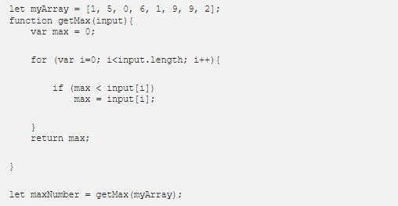

# Catatan Materi Time Complexity dan Big-O Notation

Time Complexity adalah seberapa lama waktu yang diperlukan untuk menjalankan suatu algoritma. Sedangkan Space Complexity adalah seberapa besar memori yang kita gunakan untuk menjalankan suatu algoritma. Dan disini kita hanya akan membahas tentang Time Complexity.

- <b>Apa itu Algoritma?</b>

Algoritma adalah proses atau seperangkat aturan yang harus diikuti dalam perhitungan atau operasi pemecahan masalah lainnya, terutama oleh komputer.
  

Sederhananya, algoritma adalah serangkaian proses yang dilakukan secara berurutan untuk menyelesaikan sebuah permasalahan. Algoritma bisa bermacam-macam tergantung kepada siapa yang membuat algoritma tersebut.

- <b>Apa itu Time Complexity Analysis?</b>

 <b>Time Complexity Analysis</b> adalah suatu cara sederhana untuk mengetahui berapa lama waktu yang dibutuhkan untuk menjalankan suatu algoritma dengan input tertentu (n). Biasanya lebih dikenal dengan sebutan <b>Big-O Notation.</b>

-<b>Jadi Apa itu Big-O Notation?</b>

Big-O Notation adalah cara untuk mengubah keseluruhan langkah dari suatu algoritme ke dalam suku-suku aljabar, kemudian mengecualikan konstanta dan koefisien orde rendah yang tidak memiliki dampak besar pada keseluruhan kompleksitas masalah, yaitu dengan menghiraukan konstanta yang lebih kecil dan koefisien yang tidak berdampak besar terhadap keseluruhan kompleksitas permasalahan yang diselesaikan oleh algoritma tersebut.

- Contoh :

Sederhananya, semua contoh yang ada diatas mengatakan bahwa “kita hanya akan melihat faktor yang memiliki dampak paling besar terhadap nilai yang dihasilkan oleh algoritma tersebut”.

Macam - macam <b>time complexity</b>, diantaranya : 

- O(1) — <b>Constant Time</b>

Constant Time artinya banyaknya input yang diberikan kepada sebuah algoritma, tidak akan mempengaruhi waktu proses (runtime) dari algoritma tersebut Diberikan input berukuran n, hanya dibutuhkan satu langkah algoritma untuk menyelesaikan tugas.</b>

Contoh diatas, terdapat sebuah fungsi untuk mengambil elemen pertama dari sebuah input array. Kita bisa melihat bahwa berapapun jumlah array yang diberikan kepada fungsi tersebut, dia akan selalu melakukan 1 hal, yaitu mengambil elemen pertama. Itu artinya <b>jumlah input yang diberikan tidak mempengaruhi waktu proses (runtime) dari algoritma tersebut</b>.

-<b> O(log n) — Logarithmic Time</b>

<b>Logarithmic Time</b> artinya ketika kita memberikan input sebesar n terhadap sebuah fungsi, jumlah tahapan yang dilakukan oleh fungsi tersebut berkurang berdasarkan suatu faktor. Salah satu contohnya adalah algoritma Binary Search.

<b>Binary Search</b> adalah algoritma yang kita gunakan dalam mencari posisi nilai dari suatu array dengan cara ‘mengeliminasi’ setengah dari array input untuk mempercepat proses pencarian.

- <b>O(n) — Linear Time</b>

<b>Linear Time</b> adalah ketika runtime dari fungsi kita berbanding lurus dengan jumlah input yang diberikan. 

 semakin banyak jumlah input yang diberikan, maka waktu proses/runtime dari fungsi tersebut akan semakin besar.

- <b>O(n²) — Quadratic Time</b>

<b>Quadratic Time</b> adalah ketika runtime dari fungsi kita adalah sebesar n^2, dimana n adalah jumlah input dari fungsi tersebut. Hal tersebut bisa terjadi karena kita menjalankan fungsi linear didalam fungsi linear (n*n).

- <b>O(2^n) — Exponential Time</b>

<b>Exponential Time</b> biasanya digunakan dalam situasi dimana kita tidak terlalu tahu terhadap permasalahan yang dihadapi, sehingga mengharuskan kita mencoba setiap <b>kombinasi</b> dan <b>permutasi</b> dari semua kemungkinan.

Dengan memahami <b>Big-O Notation</b>, kita akan lebih mudah dalam melihat mana algoritma yang lebih efisien yang bisa kita gunakan untuk menyelesaikan permasalahan yang sedang dihadapi.
